# EasyADSB

**Turn a Raspberry Pi into a multi-feed ADS-B tracker in minutes.**

One command. Six flight networks. A dashboard you'll actually want to look at.

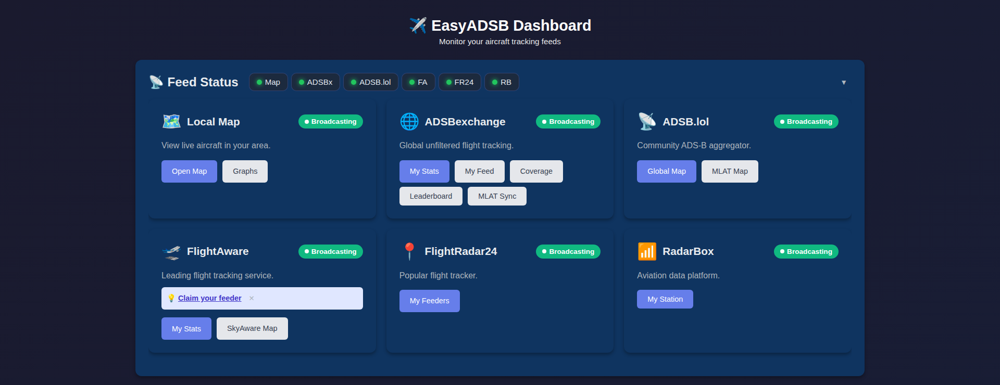

## What It Does

EasyADSB sets up your Raspberry Pi + RTL-SDR dongle to feed aircraft data to **six tracking networks** simultaneously — with a custom dashboard for monitoring everything.

| Network | Type |
|---------|------|
| ADSBexchange | Global unfiltered tracking |
| ADSB.lol | Privacy-focused community |
| FlightAware | Commercial flight tracker |
| FlightRadar24 | Worldwide tracker |
| RadarBox | Aviation data platform |
| tar1090 | Your own local map |

## Quick Start

```bash
# Install Docker
curl -fsSL https://get.docker.com | sh
sudo usermod -aG docker $USER && sudo reboot

# Clone and run
git clone https://github.com/datboip/easyadsb.git
cd easyadsb && chmod +x setup.sh && ./setup.sh
```

The setup wizard handles everything — location, service keys, Docker containers. Open `http://<your-pi-ip>:8081` when it's done.

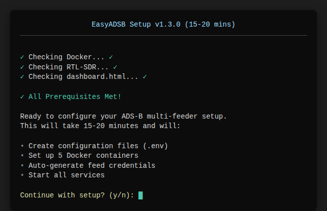

## Features

### Live Map
Interactive Leaflet map with altitude-colored aircraft, real-time heading, 6 map styles, distance rings, reception range overlay, trails, and heatmap.

<p align="center">
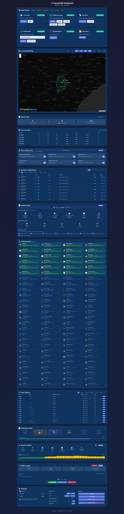 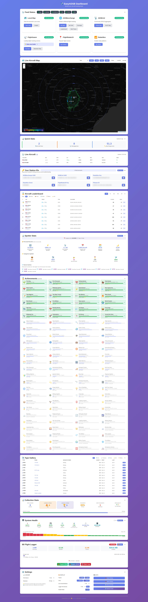
</p>

<p align="center">
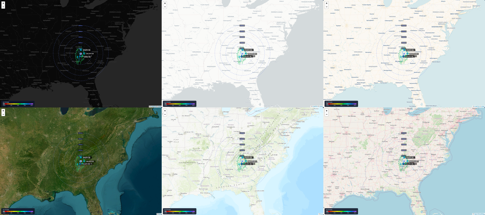 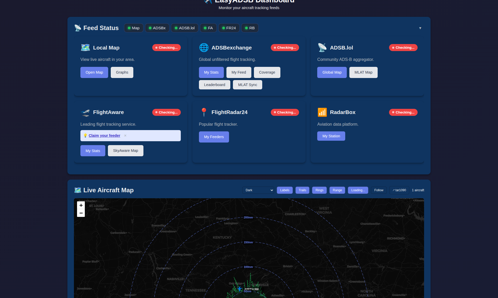
</p>

### Flight Logger
SQLite database logging every aircraft position. Configurable sample rate (5-60s), auto-cleanup, CSV/JSON export, and a full REST API.

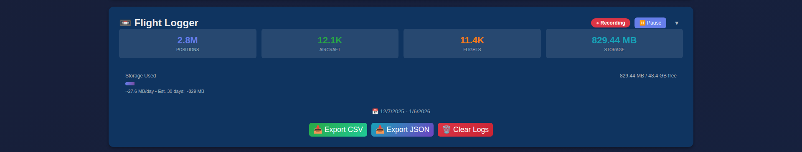

### Replay & Live Loop
Replay historical flights with a full timeline scrubber. **Live loop mode** plays the last few hours like a weather radar — loops through history, dwells on live, and repeats.

```
http://<your-pi-ip>:8081/?replay=true&live=true&hours=3
```

### Achievements & Stats
74+ achievements across 8 categories. Leaderboard with time-range filters. Personal records, aircraft type gallery, and activity heatmap.

<p align="center">
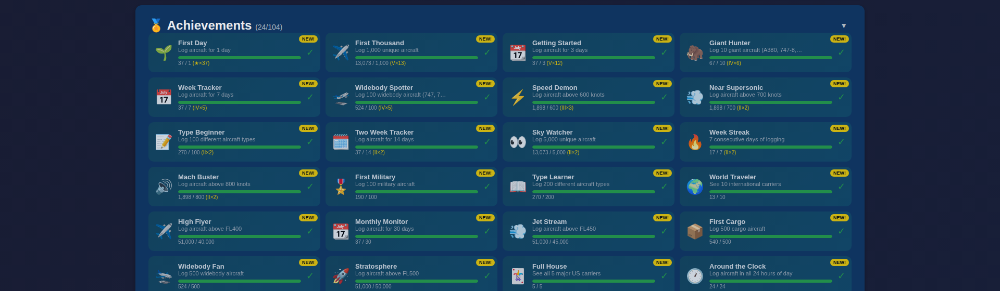 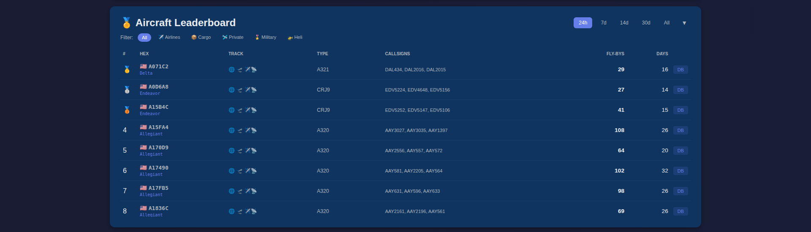
</p>

<p align="center">
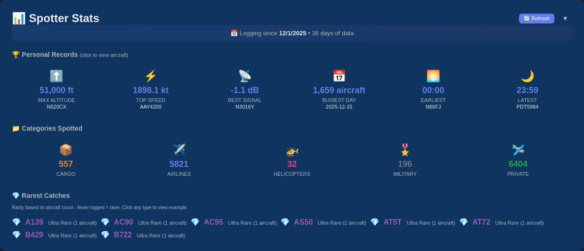 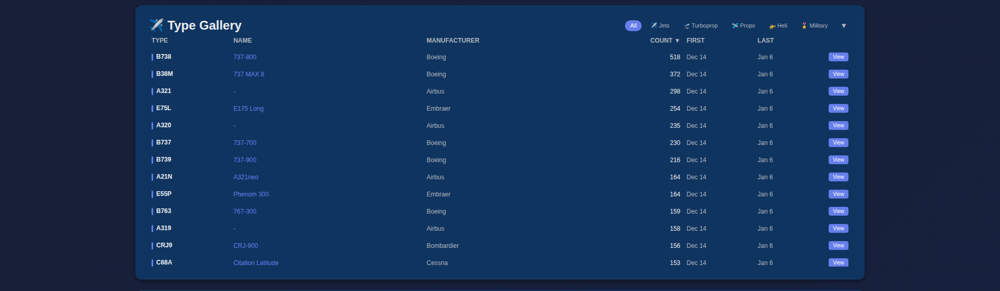
</p>

### Feed Status & Management
Live indicators for all six services. Collapsible cards, direct links to your stats, one-click backup from the dashboard.


## Requirements

- **Raspberry Pi** 3B+, 4, or 5
- **RTL-SDR dongle** (any RTL2832U-based)
- **1090 MHz antenna**
- **Docker** and **Docker Compose**
- Internet connection (Ethernet recommended)

## What's New

### v1.4.1 — Replay & Live Loop
- Weather-radar style live loop mode
- Time range presets (1h/3h/6h)
- KML export for Google Earth
- Privacy toggle (hide receiver location)
- Incremental data polling for live updates

### v1.3.x — Trails, Heatmap, Achievements
- Aircraft trails with altitude coloring
- Position density heatmap overlay
- 74+ achievements with 8 categories
- One-click backup service
- Performance optimizations for large databases

See [CHANGELOG.md](CHANGELOG.md) for full history.

## Documentation

| Doc | Contents |
|-----|----------|
| [API Reference](docs/API.md) | All 27+ logger REST endpoints |
| [Advanced Setup](docs/ADVANCED-SETUP.md) | Manual Docker config, existing credentials |
| [Troubleshooting](docs/TROUBLESHOOTING.md) | Common issues and fixes |
| [Configuration](docs/CONFIGURATION.md) | Ports, services, customization |

## Credits

Built on [ultrafeeder](https://github.com/sdr-enthusiasts/docker-adsb-ultrafeeder), [tar1090](https://github.com/wiedehopf/tar1090), and the excellent Docker images from [sdr-enthusiasts](https://github.com/sdr-enthusiasts).

## License

MIT — see [LICENSE](LICENSE).

## Support

[GitHub Issues](https://github.com/datboip/easyadsb/issues) · [Discussions](https://github.com/datboip/easyadsb/discussions)

---

**Made by [datboip](https://github.com/datboip)**
